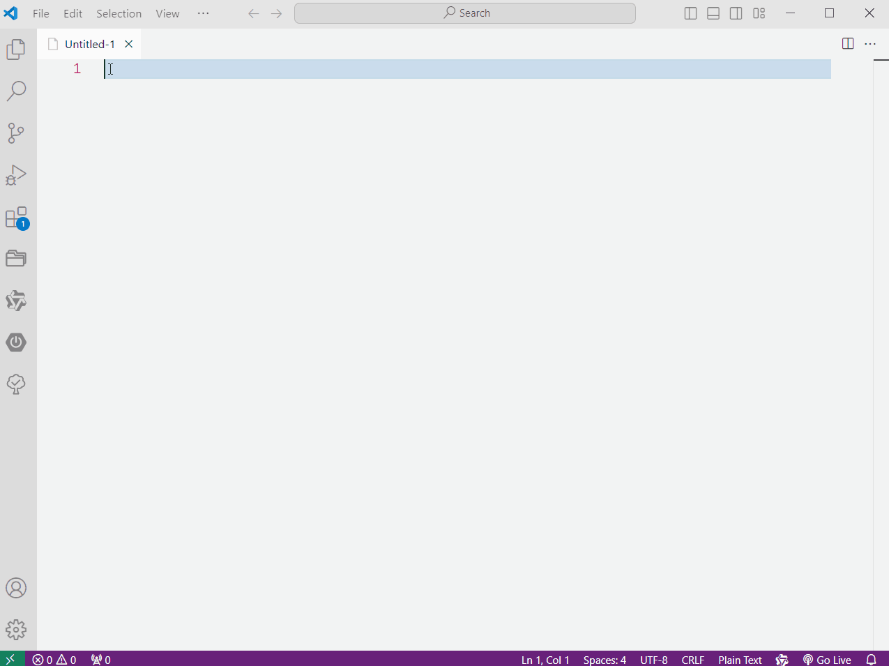

# Emoji Inserter

Insert emoji after you type two number sign(##)

## Usage
1. type two number sign(##), an input form will pop up.
2. After typing the name of the emoji and pressing enter, a list of emojis searched from the internet will be displayed.
3. Select the emoji you want, and it will be inserted at the current cursor position, replacing the two '#' symbols that were entered earlier.

## example
